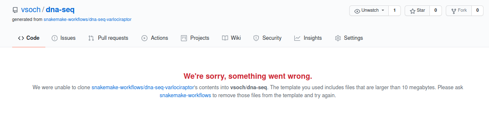

# SnakeDeploy

[](https://badge.fury.io/py/snakedeploy)


Deploy a snakemake pipeline from GitHub.

## Getting Started

SnakeDeploy is the start of a command line and interactive Python client
to easily deploy snakemake pipelines from version control like GitHub.

### 1. Install

You first might want to install the software. You can do this from GitHub or
from pypi.

```bash
pip install snakedeploy
```
or
```bash
git clone git@github.com:snakemake/snakedeploy.git
cd snakedeploy
pip install .
```

If you plan to develop and want to install from the local folder, you can do:

```bash
pip install -e .
```

You can then interact with the client.

```bash
usage: snakedeploy [-h] [--version] [--quiet] [--template] [--name NAME] [--verbose] [--log-disable-color] [--log-use-threads] [--force]
                   [repo] [dest]

Snakedeploy: deploy snakemake pipelines from version control.

positional arguments:
  repo                 Repository address and destination to deploy, e.g., <source> <dest>
  dest                 Path to clone the repository, should not exist.

optional arguments:
  -h, --help           show this help message and exit
  --version            print the version and exit.
  --quiet              suppress additional output.
  --force              If the folder exists, force overwrite, meaning remove and replace.

DEPLOY:
  --template           Template the repository first (a disconnected fork) then clone. GITHUB_TOKEN is required.
  --name NAME          A custom name for your template repository, <org/username>/<repository>.

LOGGING:
  --verbose            verbose output for logging.
  --log-disable-color  Disable color for snakedeploy logging.
  --log-use-threads    Force threads rather than processes.
```

### 2. Deploy

Deployment means that you have the following options:

 1. Clone the repository template as is, removing the .git history
 2. "Template" the repository (meaning forking without keeping connected to the parent) and clone the fork. In this case, we keep the .git history as you will likely want to push back to the repository.

For the second option, you will need a `GITHUB_TOKEN` (a personal access token) exported in
the environment. You are also given the option to specify the `--name` of your templated repository.
Both of these options are discussed in the sections below.

#### 1. Clone Template

**Important** This is the suggested approach, as the template API will not work if
there are any files over 10MB.

##### Command Line

The simplest functionality is to deploy a pipeline, which basically means 
cloning a repository to a particular destination. Since we don't want to keep git
history and accidentally push to a template, the .git folder is removed.
You can do that as follows:

```bash
$ snakedeploy https://github.com/snakemake-workflows/dna-seq-varlociraptor /tmp/dest
```
You'll then see the repository clone

```bash
Cloning into '/tmp/dest'...
remote: Enumerating objects: 99, done.
remote: Counting objects: 100% (99/99), done.
remote: Compressing objects: 100% (71/71), done.
remote: Total 1762 (delta 52), reused 55 (delta 26), pack-reused 1663
Receiving objects: 100% (1762/1762), 19.44 MiB | 2.63 MiB/s, done.
Resolving deltas: 100% (1122/1122), done.
Repository snakemake-workflows/dna-seq-varlociraptor cloned to /tmp/dest. Edit config and sample sheets.
```

And inspect the files there!

```bash
$ ls /tmp/dest/
config  LICENSE  README.md  workflow
```

This method doesn't require any sort of GitHub credential, and doesn't create a remote
repository for you.

##### Python

These same interactions can be done from within Python.

```python
from snakedeploy.providers import ProviderRunner
provider = ProviderRunner()
dest = provider.deploy("https://github.com/snakemake-workflows/dna-seq-varlociraptor", "/tmp/dest")
```

The library is fairly simple now, but will be used as a base for an interactive
tool to run snakemake workflows. Stay tuned!


#### 2. "Template" and Clone

**Important** If you find that the cloned repository is empty, this indicates that
the request was not successful. GitHub has a limitation that the template repository
cannot have files over 10MB, and it does not return an error code if this is the case.
Instead, you'll find that you cloned an empty repository, and see this error message
in your requested repository name:



In this case it's suggested to return to the first method and just clone the template.

---------------------

To create a remote repository from the template, you will need to export a GitHub
token for both the command line and Pythonic approaches below.

```
export GITHUB_TOKEN=xxxxxxxxxxxxxxxxxxxxxxxxxxxx
```

##### Command Line

To template a repository and then clone your template, you can add the --remote
flag:

```bash
$ snakedeploy https://github.com/snakemake-workflows/dna-seq-varlociraptor /tmp/dest --remote
```

If you don't provide a `--name`, then the repository will be templated with your
user account and the same name as the repository being templated. For example, if my username
is "vsoch" and I clone the repository above:

```
snakemake-workflows/dna-seq-varlociraptor --> vsoch/dna-seq-varlociraptor
```

You can change this behavior by providing a name, which might make sense if you want a custom
name for your project, or you already have a repository with the template's name. For example,
I've worked on the template as a developer, so I get an error when I try to create
a default name. Here is how I'd ask for a custom name "vsoch/dna-seq":

```bash
$ snakedeploy https://github.com/snakemake-workflows/dna-seq-varlociraptor /tmp/dest --remote --name vsoch/dna-seq
```

##### Python

These same interactions can be done from within Python. It's the same as before,
but we template our repository first.

```python
from snakedeploy.providers import ProviderRunner
provider = ProviderRunner()
repo = provider.template("https://github.com/snakemake-workflows/dna-seq-varlociraptor", name="vsoch/dna-seq")
dest = provider.deploy(repo, "/tmp/dest")
```

The library is fairly simple now, but will be used as a base for an interactive
tool to run snakemake workflows. Stay tuned!


## License

 * Free software: MPL 2.0 License
