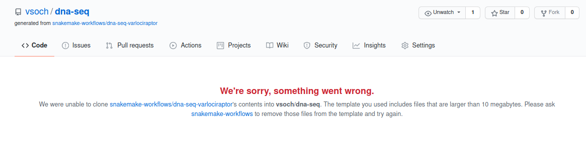

.. _template:

==================
Template and Clone
==================

**Important** If you find that the cloned repository is empty, this indicates that
the request was not successful. GitHub has a limitation that the template repository
cannot have files over 10MB, and it does not return an error code if this is the case.
Instead, you'll find that you cloned an empty repository, and see this error message
in your requested repository name:

In this case it's suggested to return to the first method and just clone the template.

To create a remote repository from the template, you will need to export a GitHub
token for both the command line and Pythonic approaches below.

.. code-block:: console

    $ export GITHUB_TOKEN=xxxxxxxxxxxxxxxxxxxxxxxxxxxx

Command Line Usage
==================

To template a repository and then clone your template, you can add the --create-remote
flag:

.. code-block:: console

     $ snakedeploy deploy-workflow https://github.com/snakemake-workflows/dna-seq-varlociraptor /tmp/dest --create-remote

If you don't provide a ``--name``, then the repository will be templated with your
user account and the same name as the repository being templated. For example, if my username
is "vsoch" and I clone the repository above:

.. code-block:: console

    $ snakemake-workflows/dna-seq-varlociraptor --> vsoch/dna-seq-varlociraptor

You can change this behavior by providing a name, which might make sense if you want a custom
name for your project, or you already have a repository with the template's name. For example,
I've worked on the template as a developer, so I get an error when I try to create
a default name. Here is how I'd ask for a custom name "vsoch/dna-seq":

.. code-block:: console

    $ snakedeploy deploy-workflow https://github.com/snakemake-workflows/dna-seq-varlociraptor /tmp/dest --create-remote --name vsoch/dna-seq

Python Usage
============

These same interactions can be done from within Python. It's the same as before,
but we template our repository first.

.. code-block::

    $ from snakedeploy.providers import ProviderRunner
    $ provider = ProviderRunner()
    $ repo = provider.template("https://github.com/snakemake-workflows/dna-seq-varlociraptor", name="vsoch/dna-seq")
    $ dest = provider.deploy(repo, "/tmp/dest")
